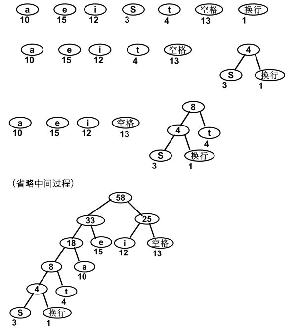

在大三选择重修两年前这门课，希望通过两年来的学习对这门课程有更深刻的见解。本文将持续更新这一学期学习过程中的思考与感悟。

## 2026.3.22

### 顺序表与链表

顺序表在内存中是一段连续的空间，因此可以通过索引直接访问任意元素。但是，顺序表插入和删除元素并不那么容易，在插入时，所有后面的元素都要向后移动一位，同理，删除元素时，所有后面的元素都要向前移动一位，这就造成了 O(n) 的时间复杂度。

链表由一系列节点组成，每个节点包含数据和指向下一个节点的指针，此外，每个链表都拥有一个头结点用来标记链表的起始位置。这些节点在内存中不是连续存储的，所以我们不能直接读取某个节点中的数据，必须通过头结点逐个访问到需要读取数据的节点。但是，链表在插入和删除时只需要常数时间，因为它只影响相邻的两个节点。**需要特别注意的是**，在插入和删除操作时，必须先将指针指向后半部分的第一个节点，再将新节点插入或把节点删除，否则会导致链表断裂。

除了简单的单链表，还有双链表和循环链表。双链表有头尾两个特殊节点，每两个相邻节点间有双向指针，便于数据访问。循环链表的最后一个节点指向头结点，形成一个环状结构，同样也可设计一个双向的循环链表，这里不再展开。

### 栈

栈是经典的先进后出数据结构，在许多算法中都有应用。从数据结构的角度看，栈的实现分为**顺序栈**和**链接栈**两种方式。

对于顺序栈，我们只需维护一个数组和一个下标 `top_p` 即可。`top_p` 被初始化为 -1，表示栈为空，有元素进栈则 +1，出栈则 -1。因为是模拟栈的设计，我们所有操作都只对下标为 `top_p` 的元素进行。

对于链接栈，我们同样只需要维护一个指针 `top_p` 即可。`top_p` 初始为 NULL，表示栈为空。有元素进栈时，创建新节点并将其链接到栈顶，`top_p` 指向新栈顶；出栈时，`top_p` 指向新栈顶，再将栈顶节点移除。链接栈的链表结构和我们之前提到的链表略有区别，它的指针方向是**新节点指向旧节点**，而且因为我们只关注栈顶元素，它不需要头结点来标记整个链表。

### 栈的应用

**函数调用：** 当一个函数被调用时，系统会将该函数的局部变量和返回地址等信息压入栈中。当函数执行完毕后，这些信息会被弹出栈，恢复到调用该函数的上下文中。尤其是对于递归函数，多层的递归调用与返回，注定了栈是非常适合这个功能的数据结构。

**表达式求值：** 栈可以用来实现表达式的计算，例如将中缀表达式转换为后缀表达式并进行求值。首先是将中缀表达式转换为后缀表达式，这点采用如下规则：
- 如果遇到操作数，直接输出到后缀表达式中。
- 如果遇到左括号，将其压入栈中。
- 如果遇到右括号，则将栈顶元素弹出并输出到后缀表达式中，直到遇到左括号为止，此时将左括号弹出但不输出。
- 如果遇到运算符，则将其与栈顶运算符进行比较，如果当前运算符的优先级较高，则直接压入栈中；否则，将栈顶运算符弹出并输出到后缀表达式中，直到当前运算符的**优先级较高**或**遇到左括号**或**栈为空**为止，然后将当前运算符压入栈中。

下表展示了上述算法处理表达式 `(5 + 6 * (7 + 3) / 3) / 4 + 5` 的过程：

| 序号 | 读剩的表达式 | 栈 | 输出 |
|------|--------------|----|------|
| 1 | (5 + 6 * (7 + 3) / 3) / 4 + 5 | | |
| 2 | 5 + 6 * (7 + 3) / 3) / 4 + 5 | ( | |
| 3 | + 6 * (7 + 3) / 3) / 4 + 5 | ( | 5 |
| 4 | 6 * (7 + 3) / 3) / 4 + 5 | ( + | 5 |
| 5 | * (7 + 3) / 3) / 4 + 5 | ( + | 5 6 |
| 6 | (7 + 3) / 3) / 4 + 5 | ( + * | 5 6 |
| 7 | 7 + 3) / 3) / 4 + 5 | ( + * ( | 5 6 |
| 8 | + 3) / 3) / 4 + 5 | ( + * ( + | 5 6 7 |
| 9 | 3) / 3) / 4 + 5 | ( + * ( + | 5 6 7 |
| 10 | ) / 3) / 4 + 5 | ( + * ( + | 5 6 7 3 |
| 11 | / 3) / 4 + 5 | ( + * | 5 6 7 3 + |
| 12 | 3) / 4 + 5 | ( + / | 5 6 7 3 + * |
| 13 | ) / 4 + 5 | ( + / | 5 6 7 3 + * 3 |
| 14 | / 4 + 5 | | 5 6 7 3 + * 3 / + |
| 15 | 4 + 5 | / | 5 6 7 3 + * 3 / + |
| 16 | + 5 | / | 5 6 7 3 + * 3 / + 4 |
| 17 | 5 | + | 5 6 7 3 + * 3 / + 4 / |
| 18 | | + | 5 6 7 3 + * 3 / + 4 / 5 |
| 19 | | | 5 6 7 3 + * 3 / + 4 / 5 + |

然后我们需要利用这个后缀表达式计算得到结果，这一步相对简单，我们只需要从左到右扫描后缀表达式，遇到操作数就压入栈中，遇到运算符就弹出两个操作数进行计算，将结果压入栈中，最后栈中剩下的那个数就是计算结果。需要特别注意的是，对于减法和除法，是用第二个弹出的数减去/除以第一个弹出的数。下表展示了上述后缀表达式的计算结果：

| 序号 | 读剩的后缀表达式 | 栈 |
|------|------------------|----|
| 1 | 5 6 7 3 + * 3 / + 4 / 5 + | |
| 2 | 6 7 3 + * 3 / + 4 / 5 + | 5 |
| 3 | 7 3 + * 3 / + 4 / 5 + | 5 6 |
| 4 | 3 + * 3 / + 4 / 5 + | 5 6 7 |
| 5 | + * 3 / + 4 / 5 + | 5 6 7 3 |
| 6 | * 3 / + 4 / 5 + | 5 6 10 |
| 7 | 3 / + 4 / 5 + | 5 60 |
| 8 | / + 4 / 5 + | 5 60 3 |
| 9 | + 4 / 5 + | 5 20 |
| 10 | 4 / 5 + | 25 |
| 11 | / 5 + | 25 4 |
| 12 | 5 + | 6.25 |
| 13 | + | 6.25 5 |
| 14 | | 11.25 |

<!-- pagebreak -->

## 2026.3.23

### 队列

队列是一种**先进先出**的线性表，在队列中插入限定在表的一端（**队头**），删除限定在表的另一端（**队尾**）。我们同样从顺序表和链表两个方面来看队列的实现方式。

#### 顺序实现

在顺序表中，如果我们考虑队头位置固定的实现方式，队头始终是数组的第一个元素，这样只需要维护队尾`rear`这一个指针，但是这种方式每次出队都会导致队列中的剩余元素移动，这需要 O(n) 的时间复杂度。 因此我们考虑加入一个指针`front`指向队头，移动指针而保持队列中元素位置不变，这样出队的复杂度就被降至了 O(1)。

但是这种操作又会带来另外的问题，我们无法利用已经出队的元素剩下的空间，解决这个问题的方式是**循环队列**。由于在线性表内存中是连续存储的，假设`rear`已经指向了最后一个空间，我们需要人为地将下一个入队元素插入下标为0的空间。为此，我们采用`rear = (rear + 1) % MaxSize`来更新指针，同理，`front`的更新为`front = (front + 1) % MaxSize`。当`rear`或`front`的值为`MaxSize-1`时，这样的更新就会使得他们的值变为0。

在解决指针更新的问题之后，我们还需要考虑判断队列空或者满的问题，为了能够区分空和满，我们规定`front`指针指向的空间不存储数据。这样队列满的条件为`(rear + 1) % MaxSize == front`，说明`rear`从后面赶上了`front`，只剩我们人为留空的一个空间。队列空的条件就很简单了，两个指针重合时表示队列为空，即`front == rear`。一般来说，队列的顺序存储都采用**循环队列**。

#### 链接实现

相比顺序结构，用单链表实现的队列非常简单。我们同样需要`front`指向队头节点，`rear`指向队尾节点，出队入队的操作都可以通过这两个指针实现，而且因为单链表没有空间的限制，我们不需要像循环链表一样考虑复杂的指针更新操作。如果我们考虑采用单循环链表，更是只需要一个指针`rear`指向队尾节点即可，出队的操作在`rear`的下一个节点上执行。

#### 队列的应用

操作系统的进程调度中队列有非常详细的应用，如最基本的先到先服务队列和进阶的停止等待队列。在《数据结构》书中也有一些具体示例，在此不再赘述。
<!-- pagebreak -->

## 2026.3.24

### 树

树有很多等价定义，或许在数据结构中不会细讲，但是在离散数学和 cs4math 中有详细的介绍，简单列举一些如下：
- 有 n 个节点的连通无向图，若恰好有 n-1 条边，则它是树
- 不存在简单回路（无环）的连通图是树
- 任意两点间存在且只存在一条简单路径的图是树
- 在任意不同两点间添加一条边，所得图恰好产生一个唯一的简单回路的图是树
- ……

同样，树有很多有趣的性质，如边最少的连通图，无环图中边最多的图等，但是这些在数据结构中讨论不多，暂且按下不表。

### 二叉树
二叉树的每个节点都最多只有两个子树，称之为左子树和右子树。二叉树是有序的，必须严格区分左右子树，即使节点只有一棵子树。如果一棵二叉树的任意一层的节点个数都达到了最大值，那么这棵树被称为**满二叉树**。在满二叉树的最底层从右至左依次去掉若干个节点，就能得到**完全二叉树**。

#### 二叉树的性质
- 第 $i$ 层上最多有 $2^{i-1}$ 个节点 $(i \geq 1)$
- 高度为 $k$ 的二叉树，最多具有 $2^{k}-1$ 个节点
- 非空二叉树的叶子节点数为 $n_0$，度为2的节点数为 $n_2$，则有 $n_0=n_2+1$
- 具有 $n$ 个节点的完全二叉树的高度 $k= \lfloor \log_2 n \rfloor+1$
- 一个完全二叉树的根节点编号为1，每一层自左至右依次编号，对于编号为 $i$ 的节点：
    - 父亲节点的编号为 $\lfloor i/2 \rfloor$
    - 左儿子编号为 $2i$，右儿子编号为 $2i+1$（如果存在左右儿子，即编号不大于 $n$ ）

### 二叉树遍历
遍历二叉树需要访问二叉树的每一个节点，并且每个节点仅被访问一次。如果我们通过递归方法访问二叉树，根据根节点、左子树和右子树的访问顺序，我们可以得到前、中、后序三种遍历方式。此外，我们还能按层次顺序访问二叉树，即层序遍历。

#### 前序遍历
先访问根节点，再依次访问左右子树。例如，对于如下的树，前序遍历结果为`A L B E C D W X`。
```
       A
      / \
     L   C
    / \   \
   B   E   D
          /
         W
          \
           X
```

#### 中序遍历
先访问左子树，再访问根节点，最后访问右子树。例如，对于同样的树，中序遍历结果为 `B L E A C W X D`

#### 后序遍历
先访问访问左右子树，最后访问根节点。例如，对于同样的树，后序遍历结果为 `B E L X W D C A`

#### 层序遍历
从上到下，从左到右依次访问树的每一层，例如，对于同样的树，层序遍历结果为 `A L C B E D W X`

反过来，我们只需要知道**前序和中序**或者**后序和中序**遍历的结果，就能唯一地确定一棵二叉树。但是如果只知道前序和后序遍历的结果并不能唯一确定一棵树，假设某个节点只有一个子树，在只知道前序和后序遍历的情况下，无法确定它是左子树还是右子树。

*今天ZZZ更新，过剧情去了，先写这么多，与树有关的内容明天继续……*
<!-- pagebreak -->

## 2026.3.25

>中午把数据科学基础的 Project 2 跑的差不多了，然后花了一下午做工科创的 Simulink 模拟，总算做的大差不差了。刚刚又收到了米哈游周六晚上的笔试通知，虽然简历是投着玩的也没报什么希望，但多少还是要准备一下的。正好数据结构与笔试机考这块还算关联挺大，正好多巩固一下基础。

### 二叉树实现
#### 顺序结构
对于完全二叉树，顺序存储就是层序遍历的结果依次存储在数组中，但是对于非完全二叉树，需要添加一些虚节点使其变成一棵完全二叉树，在存储时，用特殊值表示这些虚节点（这里用 -1 表示）。例如，对于下面这棵树：
```
      A
     / \
    B   C
   /
  D
 / \
H   I
```
在顺序表中的存储如下：
```
   A  B  C  D -1 -1 -1  H  I
0  1  2  3  4  5  6  7  8  9 
```
#### 链接实现
链接实现更符合二叉树本身的结构。根据是否需要访问父亲节点，我们将其分为**二叉链表**和****三叉链表**两类。

二叉链表的每个节点除了储存节点数据，还需要保存指向其左右子树的指针。此外，我们还需要一个指向根节点的**根指针**用来标记这棵树。如果需要找父亲节点的操作，我们需要用到三叉链表，三叉链表是在二叉链表的基础上，加上一个指向父亲节点的指针，这样就能很方便的实现寻找父亲节点的操作。实际上，找父亲的操作并不是非常常用，因此**二叉链表**是最常见的二叉树存储形式。

### 二叉链表类
这一节我们主要详述二叉树几种遍历的实现方式，分为递归实现和非递归实现。

递归实现比较简单，以下是前序遍历preOrder(tree)的伪代码（tree为根指针）：
```
preOrder(tree){
    如果tree为空, return
    访问tree->data
    preOrder(tree->left)
    preOrder(tree->right)
}
```
中序遍历和后序遍历只需要调换上面伪代码中访问data和递归调用之间的顺序即可。实际上，这正是深度优先搜索（DFS）的典型应用。

非递归实现需要我们使用之前提到的栈和队列的数据结构，相对递归实现来说，这样速度和空间都更具优势，下面依次说明。

#### 前序遍历
我们用栈实现二叉树的前序遍历，以下是算法的伪代码实现：
```
根节点进栈
当栈非空时重复：
    1. 栈顶出栈（current）
    2. 读栈顶数据（current->data）
    3. 如果右儿子非空，右儿子进栈（current->right）
    4. 如果左儿子非空，左儿子进栈（current->left）
```
由于我们要先读左儿子再读右儿子，所以进栈顺序应该是先右后左。

#### 中序遍历
中序遍历相对更加复杂，因为是先读取左子树，所以根节点出栈后不能立即访问，而是需要暂存。我们可以将根节点再次入栈，然后左儿子入栈。当左子树访问完毕后，根节点出栈，此时根节点就可以被访问了，因此，我们需要记住一个节点是第几次入栈。以下是中序遍历的伪代码实现：
```
根节点进栈（出栈次数=0）
当栈非空时重复：
    1. 栈顶出栈（current）并且出栈次数+1
    2. 如果出栈次数=2
        1. 读数据（current->data）
        2. 右儿子非空则进栈（current->right）
    3. 否则
        1. 当前节点再次进栈（current）
        2. 左儿子非空则进栈（current->left）
```

#### 后序遍历
对中序遍历扩展得到后序遍历，也就是说，一个节点要出栈三次才能访问，以下是后序遍历的伪代码实现：
```
根节点进栈（出栈次数=0）
当栈非空时重复：
    1. 栈顶出栈（current）并且出栈次数+1
    2. 如果出栈次数=1
        1. 当前节点再次进栈（current，此时出栈次数为1）
        2. 若左儿子非空，则左儿子进栈（出栈次数=0）
    3. 否则如果出栈次数=2
        1. 当前节点再次进栈（current，此时出栈次数为2）
        2. 若右儿子非空，则右儿子进栈（出栈次数=0）
    4. 否则（出栈次数=3）
        1. 读数据（current->data）
```

#### 层次遍历
与前中后序的深度优先搜索不同，层次遍历是典型的广度优先搜索（BFS），需要使用队列实现，伪代码如下：
```
根节点入队
当队列非空时重复：
    1. 队头出列（current）
    2. 读队头数据（current->data）
    3. 如果左儿子非空，左儿子入队（current->left）
    4. 如果右儿子非空，右儿子入队（current->right）
```
队列是先进先出的，所以左儿子先入队，然后右儿子入队。

### 二叉树的应用
#### 表达式树
对一棵表达式树执行后序遍历，即得到这个表达式的后缀表达式，利用前面的后缀表达式的计算方法计算即可得到结果。，例如，下面这个表达式树表示的表达式为`(4-2)*(10+(4+6)/2)+2`：
```
       +
      / \
     *   2  
    / \
  -     +
 / \   / \ 
4  2  10  /
         / \
        +   2
       / \
      4   6
```
至于中缀表达式如何转化为表达式树，书上有详细的介绍，这里不再赘述，如果是人而不是计算机来完成这项任务，只需要根据计算顺序自底向上一步步构建即可。

#### 哈夫曼树与哈夫曼编码
**哈夫曼编码**是一组最优的**前缀编码**，通过构造**最优二叉树**也就是**哈夫曼树**得到。前缀编码要求每个字符编码和其他字符编码的前缀不同，但可以有不同的长度，这样使用频率高的字符可以有较短的编码，从而减少占用的存储空间。

我们通过哈夫曼算法构造最优二叉树，哈夫曼算法维护一个森林，每棵树的权值是它所有叶子节点的权值之和。初始时，每个字符为单独的节点，拥有各自的权重。我们选取权重最小的两颗树构建一颗新树，新的权重为两颗树的权重之和。对于初始 n 个节点，经过 n-1 次合并后，整个森林只剩下一颗树了，这棵树就是哈夫曼树。如果我们规定左子树为0，右子树为1，那么从根节点到叶子节点的路径就可以编码成哈夫曼编码。下图是哈夫曼树编码的一个示例，字符 't' 对应的编码为 `0001`。



<!-- pagebreak -->
## 第五页

...
